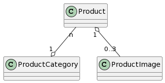

## Product catalog API

This is a simple API for managing product catalog. Built using Symfony 6.2.

It uses Elasticsearch for fulltext search and Redis for caching.

# Setup
1. Copy `.env` to `.env.local` and update the values to your needs.
2. Install dependencies: `composer install`
3. If needed, start MariaDB, Elasticsearch and Redis via Docker: `docker-compose up`
4. Start local development server: `symfony server:start`. By default, it will run on port 8000.
5. Run database migrations `bin/console doctrine:migrations:migrate`
6. You can now make requests to `/product` endpoints.

# Database model

# Endpoints
There are 5 endpoints available for manipulating products:
1. creating products:
```
POST /products
{
    "name": "J. K. Rowling: Harry Potter",
    "productCategory": {"id": 4, "name": "Books"},
    "description": "A very nice book."
}
```
Using this request we are also creating a new product category named Books.
We can also assign the new product to already existing category by setting its ID, e.g. `"productCategory": 2`,

2. editing products. It uses same body format as endpoint for creating products:
```
PUT /products/1
{
    "name": "J. K. Rowling: Harry Potter",
    "productCategory": 4,
    "description": "A very nice book. - edited description"
}
```
3. getting product detail:
```
GET /products/51
response:
{
    "id": 51,
    "name": "machinegun",
    "productCategory": {
        "name": "weapons"
    },
    "productImages": [],
    "description": "Use with care."
}
```
4. getting list of products:
```
GET /products
response:
[
    {
        "id": 49,
        "name": "iPhone 15",
        "productCategory": {
            "id": 21,
            "name": "Mobile phones"
        },
        "productImages": [],
        "description": "A brand new smartphone by Apple."
    },
    {
        "id": 50,
        "name": "Leather jacket",
        "productCategory": {
            "id": 22,
            "name": "Clothing"
        },
        "productImages": [],
        "description": "A nice jacket."
    },
]
```
5. fulltext search on products. It looks for partial match in product name or description. 
```
GET /products/search?fulltext=phon
response:
[
    {
        "id": 49,
        "name": "iPhone 15",
        "productCategory": {
            "id": 21,
            "name": "Mobile phones"
        },
        "productImages": [],
        "description": "A brand new smartphone by Apple."
    },
    {
        "id": 50,
        "name": "Moto G60",
        "productCategory": {
            "id": 21,
            "name": "Mobile phones"
        },
        "productImages": [],
        "description": "A budget phone by Motorola."
    },
]
```
